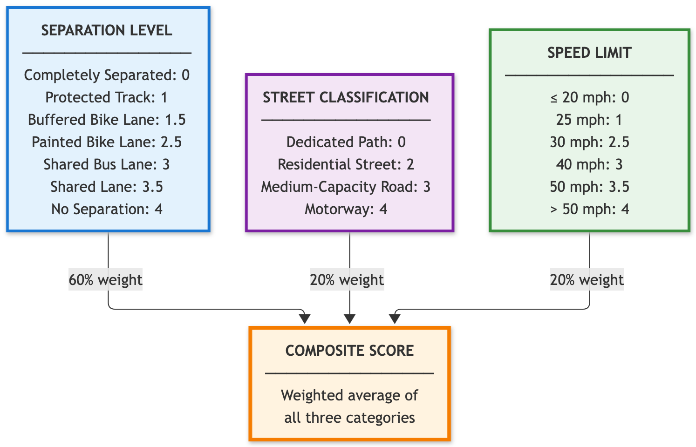

# Bike Stress Model

This is a bike route stress model and interactive map for evaluating cycling infrastructure safety and comfort using OpenStreetMap data. The project was originally produced for my Advanced GIS course at Tufts University, in the Fall of 2026, where [it won "best in show" at the Tufts GIS Expo](https://sites.tufts.edu/gis/gis-in-action/tufts-gis-poster-expo/).

> [!NOTE]
> The version of code associated with that submission is tagged [here](https://github.com/dustinmichels/bike-stress-model/tree/adv-gis).

The project consists of:

- **Python Stress Model (Root)**: Downloads OSM network data using OSMnx, evaluates street segments across infrastructure factors, and exports GeoJSON / GeoPackage networks.
- **Frontend (`frontend/`)**: Vue 3 + MapLibre web app for interactively exploring street networks with customizable weight sliders.

## Model Inputs

The model evaluates cycling stress across three active components (scored 0 for lowest stress, up to 4 for highest stress):

1. **Separation Level (`src/stressmodel/separation_level.py`)**
   - Assesses cycleway infrastructure type (`separate`, `track`, `lane_buffered`, `lane`, `share_busway`, `shared_lane`, `none`).
   - Identifies buffered lanes via `cycleway:buffer` and `cycleway:separation` tags.

2. **Speed Limit (`src/stressmodel/speed.py`)**
   - Extracts posted speeds. Residential-class streets (`residential`, `living_street`, `service`, `unclassified`, `track`) with no posted speed get the city's default: 20 mph in Somerville and Cambridge, 25 mph in Everett and Malden (`PLACES` in `main.py`). Other missing speeds stay null.
   - Maps speed to stress tiers (≤20 mph: 0, ≤25 mph: 1, ≤30 mph: 2.5, ≤40 mph: 3, ≤50 mph: 3.5, >50 mph: 4).

3. **Street Classification (`src/stressmodel/classification.py`)**
   - Classifies OSM `highway` types into broad categories: `dedicated_path` (0), `residential` (2), `medium-capacity` (3), and `motorway` (4).

A composite score is computed using the weighted average of these factors:

$$\text{Composite Score} = 0.60 \times \text{Separation} + 0.20 \times \text{Speed} + 0.20 \times \text{Classification}$$



There is a default scoring system, but a key purpose of the project is allowing parents to customize parameters according to their own personal comfort level, and create new maps accordingly. This can be done in the web app.

---

## Setup & Development

Install dependencies with [uv](https://github.com/astral-sh/uv):

```sh
uv sync
```

### Run the Pipeline

Generate network data for configured municipalities:

```sh
uv run main
```

Outputs are written to `data/out/main/`.

Geopackage files are more complete, while geojson files are santized to be more lightweight in browser.

You will be prompted with the option to copy geosjon outputs to `frontend/public/data`.

### Run Tests

```sh
uv run pytest tests/ -v
```

### Notebooks

Jupyter notebooks are located in `notebooks/`. To clear notebook output cells before committing:

```sh
mise run clear-notebooks
```

---

## Frontend Development

The frontned is built with bun/ vue/ vite/ TypeScript.

```sh
cd frontend
bun install
bun run dev
```
